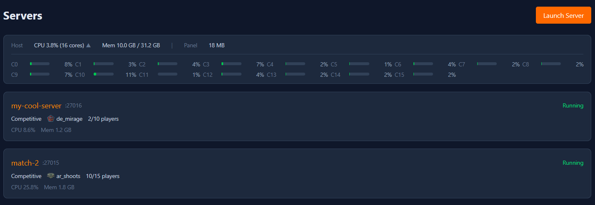
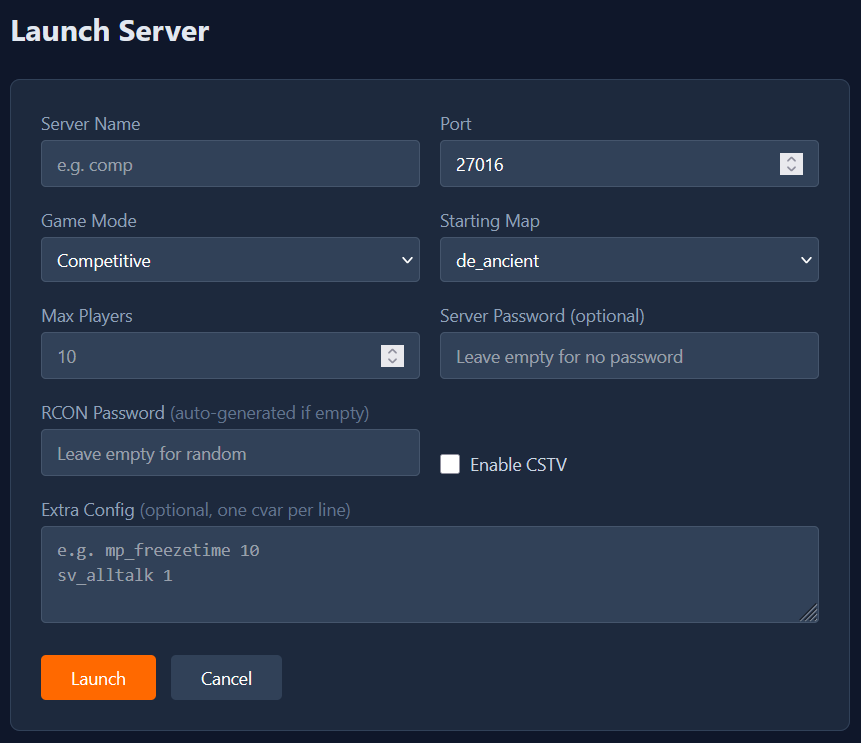
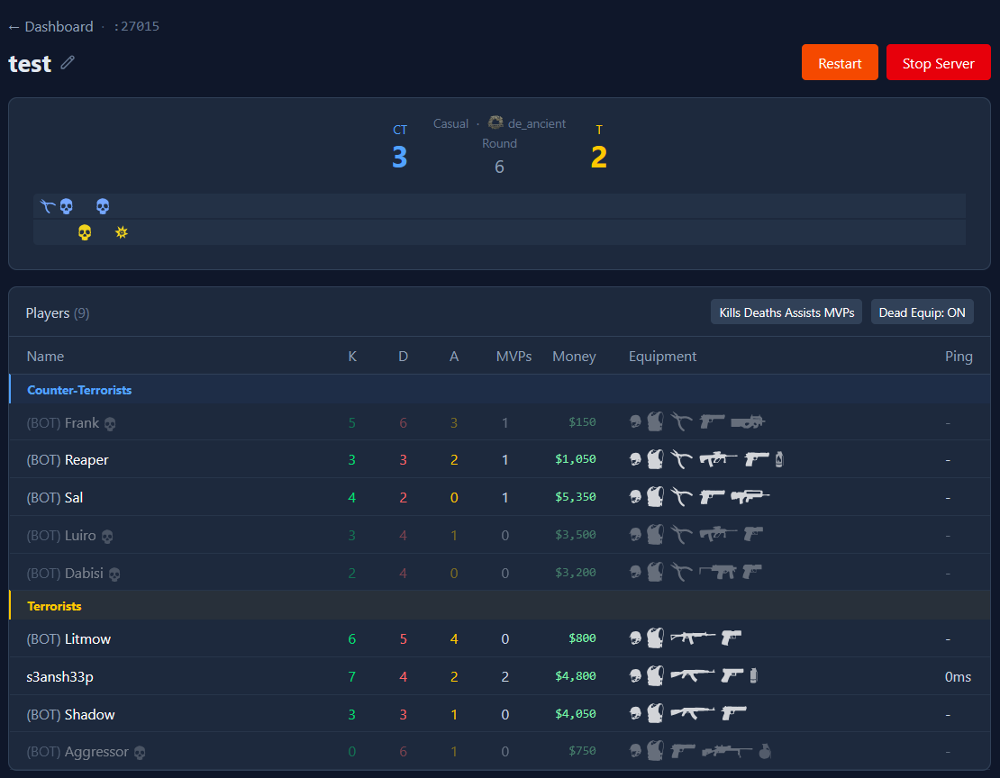
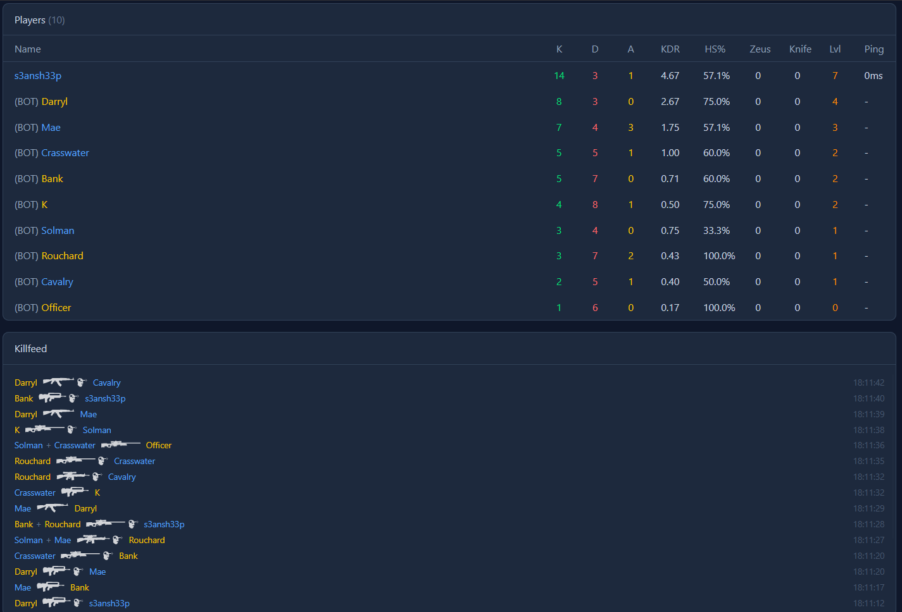
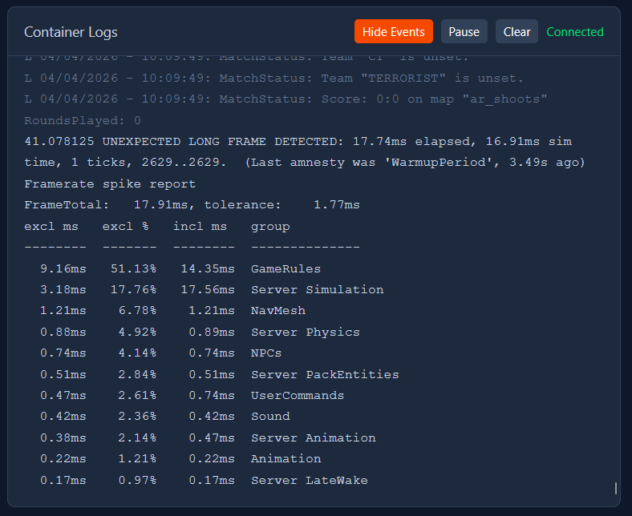
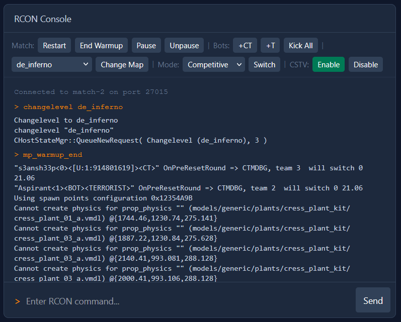
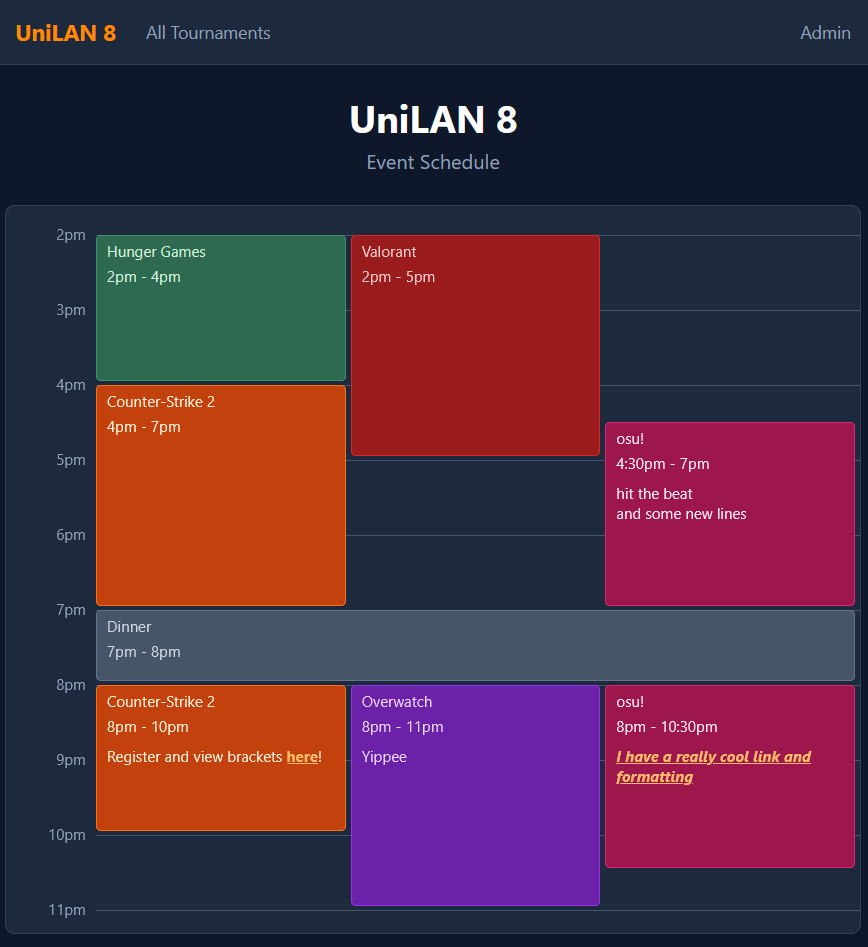
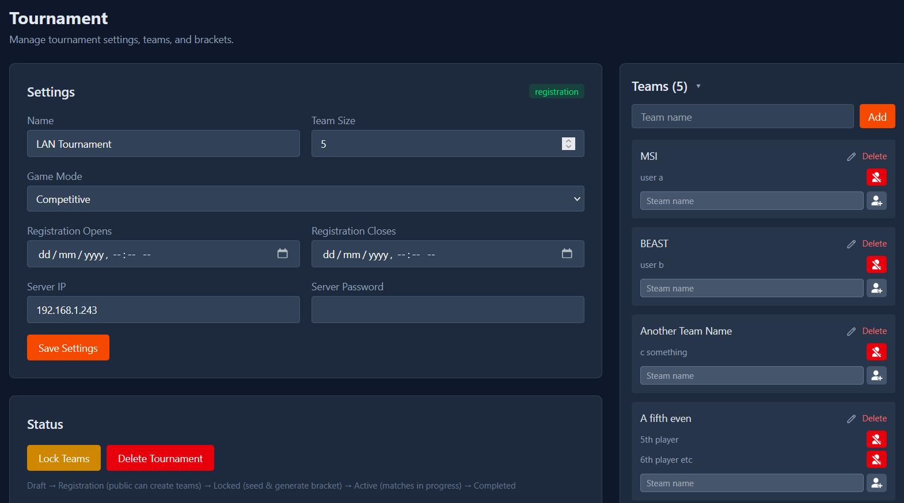
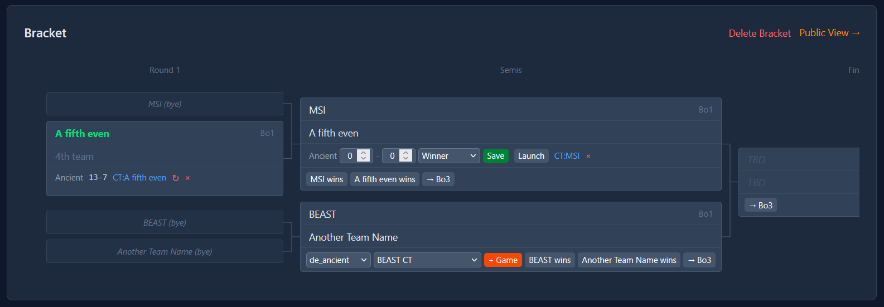
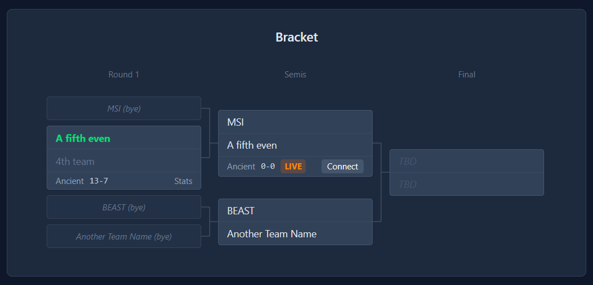

# UniLAN Panel

Run and manage multiple CS2 dedicated servers from one machine, with an optional web panel for event scheduling and tournament management. All server instances share a single copy of the game files (~60GB). Built on [joedwards32/CS2](https://github.com/joedwards32/CS2).

## Setup

**Prerequisites:** Docker, Docker Compose, ~60GB disk space.

Download the game files (one-time, ~60GB):

```bash
docker compose --profile update run --rm cs2-updater
```

### Build the web panel

```bash
cd panel
make build
# or I've committed the css files so you can just do `CGO_ENABLED=0 go build -o unilan ./cmd/panel` for the go binary without needing Node.js if you don't plan to modify the styles
```

Requires Go 1.25+ and Node.js (for Tailwind CSS compilation).

### Start the panel

```bash
./unilan --password <secret> --compose-file ../docker-compose.yml
```

Open `http://<your-lan-ip>:8080` from any device on the network.

| Flag | Default | Description |
|------|---------|-------------|
| `--password` | (required) | Panel access password |
| `--port` | `8080` | HTTP listen port |
| `--compose-file` | `./docker-compose.yml` | Path to compose file |
| `--rcon-default` | `changeme` | Default RCON password for new servers |
| `--db` | `tournament.db` | SQLite database path |
| `--tls` | `false` | Enable HTTPS with auto-generated self-signed cert (recommended for LAN) |
| `--tls-cert` | | Custom TLS certificate path |
| `--tls-key` | | Custom TLS key path |

To change the favicon, replace the contents of `panel/web/static/favicon/` with your own icons. Use [favicon.io](https://favicon.io/) to generate the required files from a text, image, or emoji.

### WSL2 network setup

If running inside WSL2, enable mirrored networking so ports are reachable from Windows and LAN clients. Add to `C:\Users\<you>\.wslconfig`:

```ini
[wsl2]
networkingMode=mirrored
```

Restart WSL (`wsl --shutdown` in PowerShell), then open the firewall:

```powershell
.\cs2-firewall.ps1 enable -WebPort 8080   # game ports 27015-27030 + web panel
.\cs2-firewall.ps1 disable                # remove all rules when done
```

---

## Web Panel

### Dashboard

The admin dashboard (`/admin`) shows all running CS2 server instances with live status. Each server card shows current map, player count, game mode, and resource usage. Host system CPU and memory stats are displayed at the top.

From here you can launch new servers, stop or restart existing ones, and jump into any server's detail view.



### Launching a server

The launch page (`/admin/launch`) lets you spin up a new CS2 server instance. Pick a name, port, game mode (competitive, casual, deathmatch, wingman, etc.), starting map, max players, and optional server/RCON passwords. RCON passwords are auto-generated if left blank. CSTV can be toggled on for spectating.

Each server runs as a Docker container with host networking, so players connect directly to `<your-lan-ip>:<port>`.



### Server detail

Clicking into a server (`/admin/server/{name}`) gives you:

**Live scoreboard** — Real-time player stats updated via WebSocket: kills, deaths, assists, ADR, headshot %, money, equipment (armor, helmet, defuser, bomb carrier), and purchased weapons/grenades with icons. Teams are split by CT/T side with round scores and half-time tracking. Warmup and pause states are detected and displayed. The columns are dependent on the game mode, e.g. Arms Race includes Knife and Zeus kills, Competitive modes include money and equipment etc.



**Killfeed** — A real-time feed of kills as they happen, showing killer, victim, weapon icon, and modifiers (headshot, wallbang, noscope, through smoke, blind kill, etc.). Bomb plants, defuses, and round end events also appear.



**Live logs** — WebSocket-streamed server output with filtering (toggle game events vs system messages), pause/resume with buffering, and automatic deduplication of repeated lines.



**RCON console** — Execute RCON commands directly from the browser and see the response.



---

## Event Schedule

The homepage (`/`) displays a Google Calendar-style timeline for the event. Admins configure the event time bounds in Settings, then create and manage schedule items via a drag-and-drop calendar at `/admin/schedule`. Items can be dragged to move, resized from the bottom edge, and clicked to edit.

Each item has a title, start/end time, color (10 presets), and an optional rich description supporting bold, italic, and links. A live "now" line tracks the current time on both public and admin views. All changes sync instantly to connected clients via WebSocket.



---

## Tournament mode

The panel includes a full single-elimination tournament system. Everything updates in real-time over WebSockets — both the admin view and the public bracket.

### Tournament setup

Create a tournament from `/admin/tournament` with a name, team size, game mode, and the server IP/password that players will connect to. Set a registration window to control when teams can sign up.



### Team management

Teams can be created by admins directly, or by players themselves during the registration window via the public page. Each team has a name and a list of members identified by their Steam display name. Admins can add/remove members and rename teams at any time.

### Bracket

Once teams are locked in, seed them from the admin panel to generate a single-elimination bracket. Seeds are matched 1 vs N, 2 vs N-1, etc. Byes are automatically assigned if the team count isn't a power of 2.

Each match can be configured as Bo1, Bo3, or Bo5. Within a match, you create individual games — each with a map and starting side (CT/T) assignment. Games can be linked to a running server instance so scores are tracked automatically.



### Automatic score tracking

When a game is linked to a running server, the panel's game tracker monitors the match in real-time:

- Parses round results from CS2's native `round_stats` JSON output
- Tracks CT/T round wins per half and maps them to the correct teams using the starting-side assignment
- Handles half-time side swaps and overtime automatically
- On match end, records final scores, round-by-round history (with win reason: elimination, bomb, defuse, time), and per-player statistics (K/D/A, HS%, ADR, MVPs, enemies flashed, utility damage)
- For Bo3+, automatically creates the next game when the current one finishes (if the series isn't decided)
- Winners advance through the bracket automatically

Scores can also be set manually if needed — useful for resolving disputes or recording offline matches.

### Public bracket view

Tournament brackets are accessible at `/tournament/{id}` (or via the "All Tournaments" link on the homepage). Each bracket page shows:

- The full bracket with team names, match scores, and game status (pending/live/completed)
- Live games display a "Connect" button with the `connect` command players can copy
- Completed games have a "Stats" button that opens a modal with round-by-round history and full player stat tables
- During registration, teams can sign up and manage their roster directly from this page

Everything updates live via WebSocket — no page refreshes needed.



[SCREENSHOT OF THE POST-GAME STATS MODAL SHOWING ROUND HISTORY AND PLAYER STATS TBA]

---

## How it works

### Architecture

```
┌───────────────────────────────────────────────────┐
│              Web Panel (Go binary)                │
│                                                   │
│  HTTP server ─── Admin UI + Public schedule/bracket│
│  WebSockets ──── Live logs, scores, schedule      │
│  RCON client ─── Server commands + polling        │
│  Docker API ──── Container lifecycle              │
│  Game tracker ── Log parsing + score recording    │
│  SQLite DB ───── Tournament, teams, matches       │
└────────┬──────────────┬──────────────┬────────────┘
         │              │              │
    Docker API     RCON (27015+)    WebSocket
         │              │              │
    ┌────▼────┐    ┌────▼────┐    ┌────▼────┐
    │ cs2-srv1│    │ cs2-srv2│    │ cs2-srv3│
    │ :27015  │    │ :27016  │    │ :27017  │
    └─────────┘    └─────────┘    └─────────┘
         │              │              │
         └─── Shared cs2-base volume ──┘ 
              (read-only game files)
```

Each server instance is a Docker container using host networking. They all mount the same `cs2-base` volume (game files downloaded once by `cs2-updater`), with a per-instance tmpfs for the `cfg` directory so config writes don't collide.

The panel communicates with servers via RCON (connection-pooled with idle timeout) and monitors them by streaming container logs through the Docker API. The game tracker parses these logs in real-time to extract kill events, round results, and player statistics.

### Database

SQLite with WAL mode. Stores schedule items, tournaments, teams, team members, bracket matches, individual games (with half-by-half score breakdowns), round history, and per-player stats. The schema auto-migrates on startup.

### Server config

All servers load `lan-default.cfg` after `server.cfg`, which sets LAN-friendly defaults (overtime enabled, autokick off, CSTV delay, etc.). Additional per-server config can be injected via the `CS2_EXTRA_CFG` environment variable.

---

## Demo recording

CSTV must be enabled on the server (`--tv` flag) for demo recording to work (practically this means enabling CSTV when launching the server in the web interface). You can then record demos via RCON (from the panel's RCON console or CLI):

```
tv_record mydemname
tv_stoprecord
```

Or enable automatic recording so every match is captured (this is the default in the `lan-default.cfg`):

```
tv_autorecord 1
```

### Where demos are stored

Auto-recorded demos are written to `/home/steam/cs2-dedicated/game/csgo/replays/` inside the container. Manual `tv_record` demos go to `/home/steam/cs2-dedicated/game/csgo/`. This path lives on the shared `cs2-base` Docker volume, so demo files persist even after a server is stopped and removed. All server instances share the same volume, so demos from different servers will sit in the same directory.

### Copying demos out

Copy a specific demo from a running (or stopped, if the container still exists) container:

```bash
docker cp cs2-comp:/home/steam/cs2-dedicated/game/csgo/replays/ ./demos/
```

Or access demos directly from the Docker volume on the host:

```bash
# Find the volume mountpoint
docker volume inspect cs2-base --format '{{ .Mountpoint }}'

# List all auto-recorded demo files
sudo ls "$(docker volume inspect cs2-base --format '{{ .Mountpoint }}')/game/csgo/replays/"

# Copy them somewhere
sudo cp "$(docker volume inspect cs2-base --format '{{ .Mountpoint }}')/game/csgo/replays/"*.dem ./demos/
```

---

## Updating game files

Stop all running servers first:

```bash
docker stop $(docker ps -q --filter "name=cs2-")
docker compose --profile update run --rm cs2-updater
```

---

## CLI usage

The panel is the primary interface, but shell scripts are available for quick server management without the web UI:

```bash
./cs2-launch.sh <name> <port> [options]   # launch a server
./cs2-status.sh                           # list running servers
./cs2-stop.sh <name>                      # stop a server
./cs2-cmd.sh <name> <command>             # send a console command
```

Launch options:

| Flag | Default | Description |
|------|---------|-------------|
| `--mode` | `competitive` | Game mode (`competitive`, `casual`, `deathmatch`, `wingman`, etc.) |
| `--map` | `de_inferno` | Starting map |
| `--players` | `10` | Max players |
| `--password` | | Server password |
| `--rcon` | `changeme` | RCON password |
| `--tv` | off | Enable CSTV |

```bash
./cs2-launch.sh comp   27015 --mode competitive --map de_dust2 --players 10
./cs2-launch.sh dm     27016 --mode deathmatch --players 16
./cs2-launch.sh casual 27017 --mode casual
```

You can also attach to a server console directly:

```bash
tmux new -s comp 'docker attach cs2-comp'
# Ctrl+B then D to detach (server keeps running)
```
